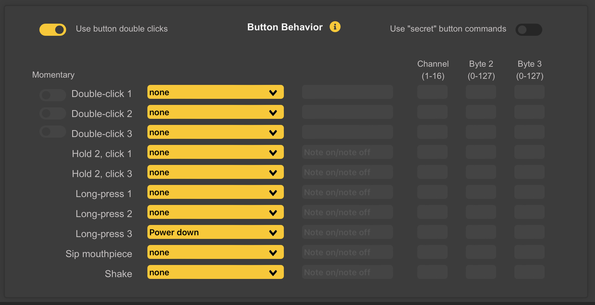

# Button Behavior

## Double-Click Option

A toggle switch at the top left of the *Button-Behavior Screen* (see above) enables the *Double-Click Option*. This applies to the first 3 gestures (slots).

*  When active, the corresponding action will take place only after a **Quick Double Press** of the button. 
  * This is intended to avoid *Accidental Clicks* while playing.
* When enabled, the *Momentary Option* takes precedence.

## “Secret" Button Commands
A toggle switch at the top-right of the *Button Behavior Panel* enables additional *Hard-Coded Actions* that involve *Covering Certain Tone Holes* while clicking *WARBL2 Button 1*. 

These can be useful if *Normal Button Actions* are used for *Other Functions*, giving an alternative way of *Changing Slide/Vibrato Mode* and *Instrument*. 

With the *Use Secret Button Commands* turned *On*:

* Covering only *Tone Hole L3* while pressing *WARBL2 Button 1* will change the *Slide/Vibrato Mode*, and
* Covering only *Tone Hole R3* while pressing *WARBL2 Button 1* will change the *Instrument*.

**Note: The *Use Secret Button Commands* switch does not have to be ON to use the *Secret Drone Control Button*, if that option is selected in the *Drones Control Panel*.**

## Button Actions

*WARBL2 Buttons 1, 2,* and *3* can be programmed to perform different actions. This is useful for sending special *Commands* to *MIDI Apps*, or customizing the ability to *Switch Modes*. 

**Note: It can be confusing if you assign different Buttons Actions in the three different Instruments, so it may be useful to use the same Actions in all three.**

### WARBL2 Actions

New to WARBL2 are *2 Additional Actions* included with the *Button Actions* to trigger *Commands*:

* You can either "sip" the *Mouthpiece*, or 
* *Shake the Device*.

Because these are both relatively easy to do accidentally, it is recommended to only use these for commands that won't have adverse effects or cause confusion if triggered accidentally, e.g. *Re-Centering Yaw* or *MIDI Panic*.

If a WARBL2 *Button Click* is configured to send *MIDI Note On/Note Off Messages*, the normal behavior is to alternate between sending *Note On* and *Note Off* Messages each time the *WARBL2 Button* is **Pressed**.

**Note: The Action actually occurs when the button is **Released**.**
	
### Momentary
There is also the option to choose *Momentary* behavior: the *WARBL2 Button* will send a *Note on Message* when **pressed** and a *Note Off Message* when **released**, useful if you only want a *Note* to be on when the *WARBL2 Button* is held **Down**, for example for mimicking *Uilleann Pipe* regulators.

**Note: If Momentary is Selected, other Actions using that same Button will be Disabled, because it's not possible to differentiate other intentions from a Momentary Press.**

### None
No action will result if a *WARBL2 Button* is pressed.

## Send MIDI Message

### Note On/Note Off
If you are sending *Note on/Note Off Messages*:

* byte 2 is the *MIDI Note Number*, and 
* byte 3 is *Velocity*

### CC Messages
If you are sending *CC Messages*:

* *byte 2* is the *CC Number*, and 
* *byte 3* is the *Value*

**Note: CC Messages 102-119 on Channel 7 are reserved for the Configuration Tool, so WARBL cannot be programmed to send additional messages in this range.**

### Send PC
Selecting this will send a *Program Change Message* to the selected *Channel*, useful e.g. to *Select a Particular Instrument* in a *MIDI Host App*.

### Increase PC and Decrease PC
These assume a *Program Change* value of **1** when WARBL2 is started, then *Increase* or *Decrease* it from there, e.g. clicking a *WARBL2 Button* assigned to *Increase PC* after starting WARBL will send a *PC Message* of **2** on the selected *Channel*.

These commands are useful for *Consecutively Stepping Through Available Sounds* in a *MIDI App*.

### Additional Momentary Switches
*Momentary Switches* are available when you have selected:

* *Octave Shift Up*
* *Octave Shift Down*
* *Semitone Shift Up*, or
* *Semitone Shift Down*.

This allows you to use a *WARBL2 Button* to momentarily shift the *Octave* or *Key*, extending the range of the *Instrument* and allowing any *WARBL2 Button* to act as a "key" for *Sharpening* or *Flattening* a *Note*.

### Auto Callibration
A *WARBL2 Button* can be assigned to begin *Auto Calibration*. This can be useful if you anticipate needing to auto calibrate when you don't have access to the *Configuration Tool*.

However, you'll want to use a *WARBL2 Button* combination that can't be *Triggered Accidentally*, for example holding *WARBL2 Button 2* and clicking either *WARBL2 Button 1* or *WARBL2 Button 3*.

Also, when you begin *Auto Calibration* with a *Button Combination*, you need to be careful not to cover any of the *Sensors* while pressing the *WARBL2 Buttons*, because if you are pressing firmly on the *Sensors* when *Auto Calibration* begins it will give WARBL incorrect examples of covered *Sensors*.

### Power Down
By default, a long-press of *WARBL2 Button 3* will power down the WARBL2. If you'd prefer not to use a button to power down, you can choose to let it power down automatically (see the WARBL2 Settings Panel).

### Recenter the Yaw
Recenters the *Yaw*.

### Show Battery Level
When triggered, will blink the LED *Turquoise* from 1-10 times according to the *Battery Level Percentage*. If the *Battery Level* is lower than 10%, the LED will blink *Red* once.

