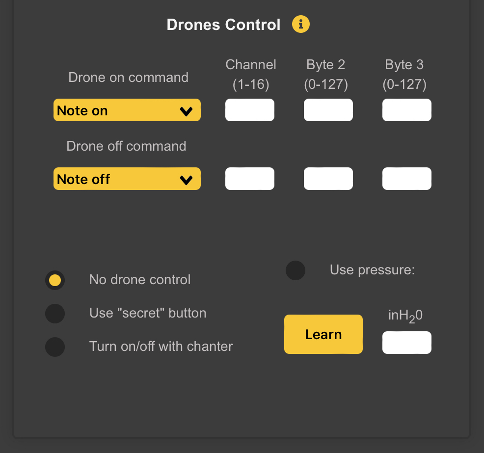

# Drones Control

WARBL makes it possible to control *Drones* in *MIDI Bagpipe Host Apps* by choosing from a few ways of sending *Drones On* and *Drones Off* commands. 

You can choose to send:
*  *Note On*
*  *Note Off,* or 
*  *CC Messages*, 

And assign the:
* *Channel*
* *Byte 2* and 
* *Byte 3*.

For *Note on* and *Note Off Messages*
* *Byte 2* is a *MIDI Note Number*
* *Byte 3* is *Velocity*

For *CC Messages*
* *Byte 2* is the *CC Number*
* *Byte 3* is the *Value*

The *Commands* used for *Turning Drones On* and *Off* will depend on the *MIDI Host App*. For example, the **Celtic Sounds** app uses a *Note On Command* both for turning *Drones* both *On* and *Off*. In apps such as **Universal Piper**, you can choose which *Command* you'll use to control the *Drones*.

## No Drone Control
Select this to assign a *Specific Button Action* to control the *Drones*, and then assign a *WARBL2 Button Action* to *Turn Drones On/Off* in the *Button Behavior* panel below.

## Use Secret Button
Allows you to turn the *Drones On* and *Off* by pressing *WARBL2 Button 1* while covering the *Right-Hand Index-Finger Hole*.

## Turn On/Off With Chanter
Will cause the *Drones* to be *On* whenever the *Chanter* is playing. This will be true no matter how you control the *Chanter*, so will work in *Bagless Mode* as well as using the *Pressure Sensor*.

## Use Pressure
Will turn the *Drones On* and *Off* at a given *Pressure Threshold*, so, for example, you can mimic *Real Bagpipes* by having the drones come *On* at a *Baseline Pressure* and the *Chanter* come *On* at a *Higher Pressure*.

### Learn
You can either *Learn* the pressure by tapping this button, or enter it manually as *inH~2~O*, as with the *Note Trigger Pressure*.

