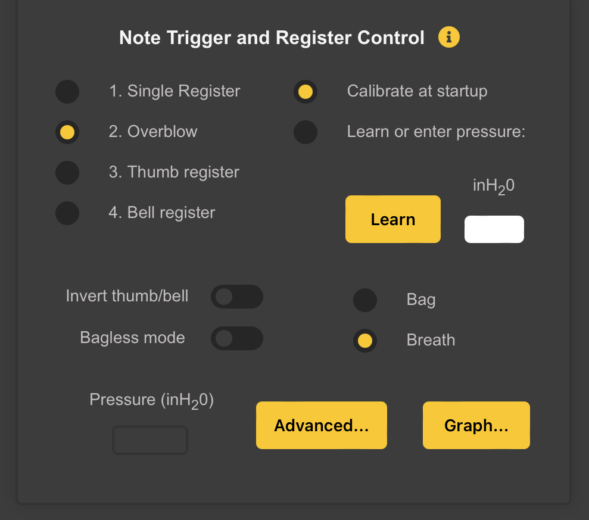
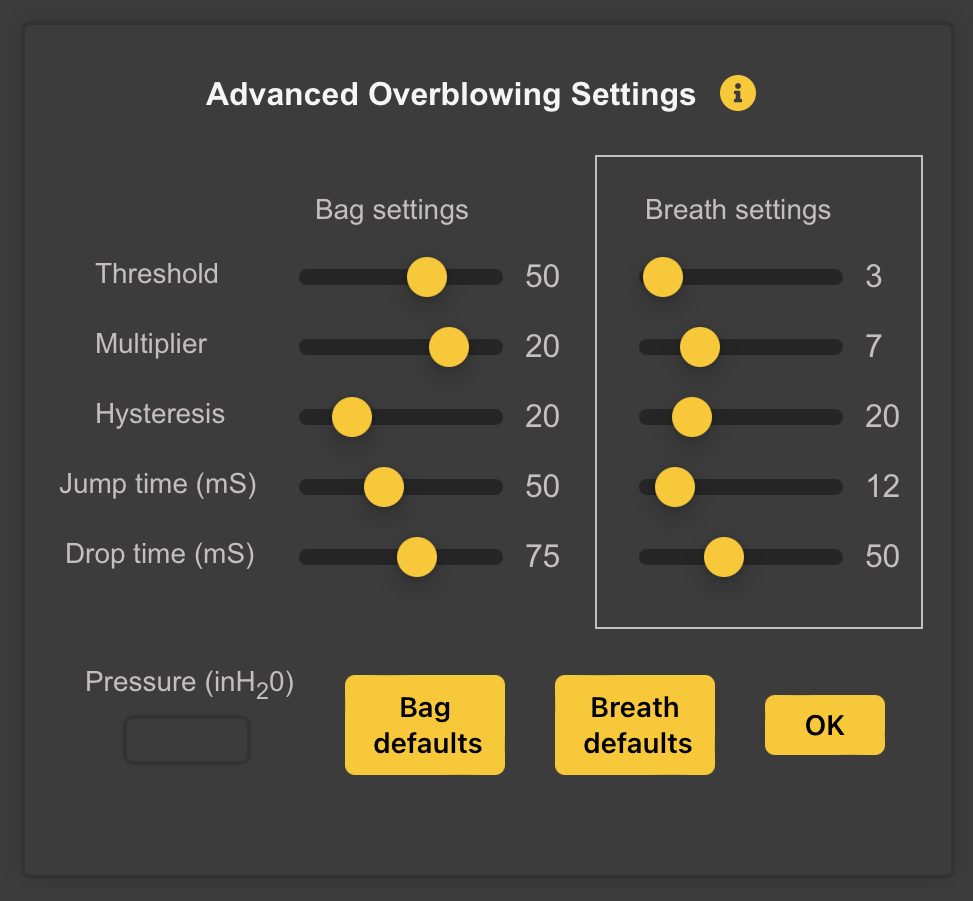
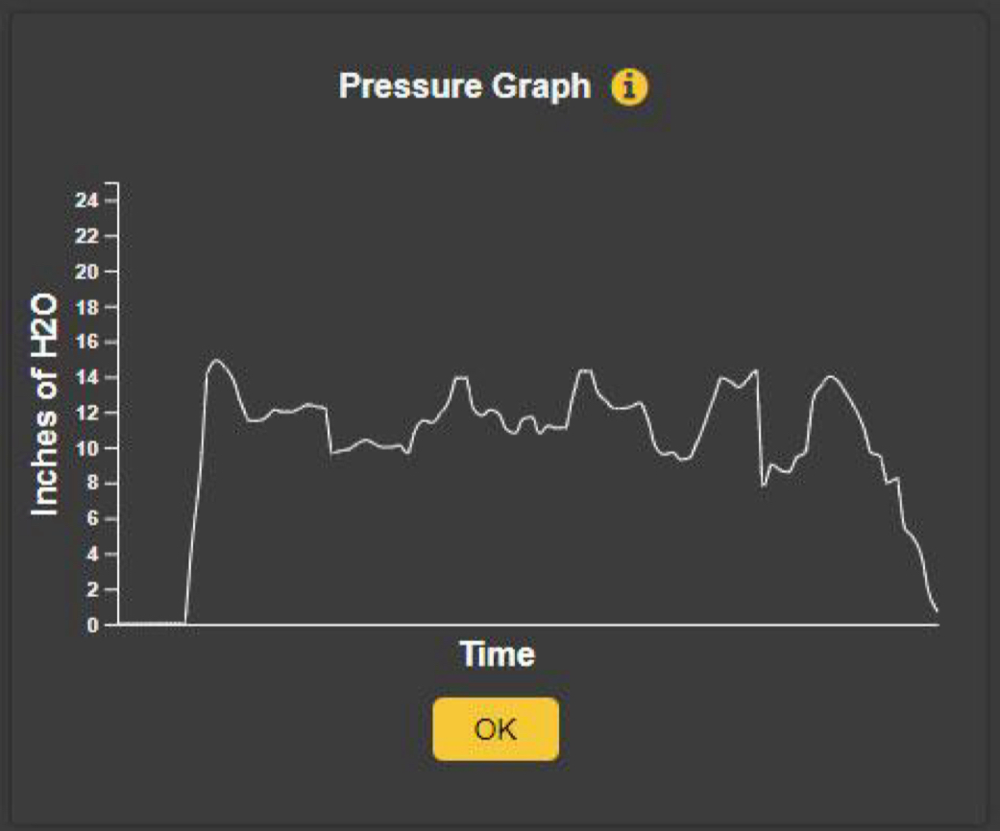

# Finger Vibrato and Slide

WARBL mimics open-tone hole instruments by sensing the distance of your fingers from the holes and using this information to bend notes downward. It can detect your fingers a maximum of about 1 cm (~1/2") from the holes.

You can choose:
1. Slide and vibrato
2. Vibrato only
3. No pitch bend, or
4. Legato slide/vibrato.

## Slide
The way *Slide* works is that lowering the finger over the highest uncovered hole will gradually flatten the current note down to the next lower note on the scale, much like on a real instrument. This can also allow you to approximate "half-holing" accidentals.

Because of the nature of note transitions in MIDI, sliding between notes can sometimes result in a slight "popping" sound when the new note is triggered. This is quite apparent with some sounds like whistles and less so with other sounds like reed instruments. Whether you choose to use slide may depend partly on the MIDI host and sounds that you're using.

The normal *Slide* feature is limited to a maximum of 2 semitones before a different MIDI note is triggered.

## Vibrato
Lowering fingers over any open holes (other than the *Slide* hole, if you also have *Slide* turned on) will gradually flatten the note down to the selected maximum vibrato depth.

The **Pitch Bend** contributed by each hole is cumulative, meaning that lowering fingers over multiple holes simultaneously will flatten the note more than lowering just one finger. This gives control over the amount of *Vibrato*, and can be used to simulate sliding even when *Slide* isn't turned on.

If a finger is covering a hole when a note is triggered and subsequently lifting that finger doesn't cause a different note to be triggered, then that finger will be available to use for *Vibrato*. However, to enable that finger, you first must remove it completely, past where WARBL can first detect it. This is to prevent problems with closed fingering patterns.

As an example of how this works, if you trigger a note, completely remove a finger (one that doesn't change the current note), and then place it back down, the resulting pitch will be lower than the originally triggered note because vibrato has been enabled. This is usually intuitive, but it's important to understand because in certain cases it might not be immediately apparent why the resulting pitch is lower than the original pitch.

You can select at the bottom of the panel which holes you'd like to have available for *Vibrato*. If you normally only use a few fingers for vibrato, you may want to select only those holes, to prevent unwanted behavior.

### Custom Vibrato
*Custom Vibrato* is a different *Vibrato* option only available for some *Fingering Patterns *(currently **Tin Whistle**, **Uilleann Pipes**, **GHB**, and **Northumbrian Pipes**).

#### **Tin Whistle** and **Uilleann Pipes**
The differences from normal *Vibrato* are as follows:
1. Only the first and/or second fingers of the right hand are available for *Vibrato*, depending on the fingering pattern (you cannot select vibrato holes if this option is turned on).
2. Vibrato is not cumulative, meaning that lowering more than one finger doesn't increase the vibrato depth.
3. If a vibrato hole is covered when a note is triggered, the note is immediately flattened (this is the major difference and may be more natural in certain circumstances).
4. When playing a back D with *Uilleann Fingering*, uncovering a *Vibrato Hole* actually lowers the pitch instead of raising it, which is how real pipes behave.

#### **GHB** and **Northumbrian Pipes**
*Custom Vibrato* is designed for *Closed Fingering* systems. It sharpens the note when finger R2 or R3 is raised from a *Closed Fingering* position (as opposed to the *Normal Vibrato*, where lowering a finger from an open position flattens a note).

	NOTE: Custom Vibrato is not available when any Unsupported Fingering has been chosen.

## Legato Slide/Vibrato
This is different from the normal *Slide* in that it allows you to slide seamlessly over a range of more than 2 semitones without triggering a new MIDI note.

The sliding range is determined by the:
* **MIDI Bend Range (Semitones)** setting at the top of the **Configuration Tool**, and the
* **Legato Slide Limit (Semitones)** setting in the *Advanced Pitch Bend Settings* panel.

For proper *Slide* and *Vibrato* results, the **Pitch Bend Range** in the MIDI app or host that you are using must be set to the same number of semitones as the **MIDI Bend Range (Semitones)** setting.

*Legato Slide/Vibrato* also uses additional holes as *Slide Holes*. Rather than using only the *highest uncovered hole*, it uses any hole that would normally cause a new note to be triggered if it was covered.

## Advanced Pitch Bend Settings

### 
The *Advanced... Button* opens the *Advanced Pitch Bend Settings Box*. These settings can be left unchanged, but allow more control over how WARBL sends *Pitch Bend Messages*.

### Finger-Sensing Distance 
This is the relative distance at which the tone holes sense your fingers for slide and vibrato. You can reduce this distance using the slider if you don't want to have to remove your fingers as far from the holes to turn off the pitch bend. The downside is that you'll have less precision in bending notes.

### Vibrato depth (cents)
The slider determines the degree to which notes are bent when using finger vibrato.

### Legato Slide Limit (semitones)
This setting determines the maximum range for sliding if you are using the *#4. Legato slide/vibrato* option (see above). Note that the *MIDI Bend Range (Semitones)* must also be set at least as high, and you must also always set the *MIDI Pitch Bend Range* in whatever *MIDI App* or *MIDI Host* you are using, to the same value as the *MIDI Bend Range (Semitones)* setting.

## Send Pitch Bend Immediately Before Note On
Normally, WARBL sends a *Pitch Bend Message* after a new *MIDI Note* is turned on. Some users may instead wish to send *Pitch Bend* before the note is turned on by using the *Send pitch bend immediately before Note On* switch. This may cause *Pitch Bend Audio Artifacts* with some *MIDI Apps* but is the recommended setting for *MIDI MPE*.

## Send Notes As Legato
The *Send notes as Legato* switch causes WARBL to wait to turn off each *MIDI Note* until after the next *MIDI Note* is sent. This is the recommended setting for most *MIDI Apps* as it allows them to interpret the *MIDI Notes* as *legato*, allowing them to flow together seamlessly.

[Repeat Section](#finger-vibrato-and-slide) -- [Table of Contents](#table-of-contents)

# Note Trigger and Register Control

You can play in a *Single Register* or choose from *Several Options for Controlling the Register*. 

## Single Register
Will allow you to use breath or bag pressure to start/stop notes, but will only allow access to one register. The pressure sensor can be used to mimic the way that whistles, flutes, and some bagpipes can be "overblown" to reach the second octave.

## Overblow
Enables Overblow

## Thumb Register
Allows you use that finger to control the *Register*, which will be familiar to players of many *Woodwind Instruments*. To play the *Upper Register*, simply uncover the thumb hole.

## Bell Register
Uncovering the *Bell Sensor* (lifting it off your knee), will access the **Second Register**.

## Calibrate at startup
The *Pressure Sensor* normally will be calibrated at *Startup*, meaning that the pressure when you plug in the device will be used as a *Base Point* for determining the *Pressure Level* at which sound will be triggered. This is desirable if you are using breath to control the instrument.

If you are using a *Bag* with this setting, you will want to squeeze it when you plug WARBL in to set the *Pressure* at which you want *Notes to Begin Playing*.

## Learn or Enter Pressure
Alternatively, you can select to use a different *Startup Pressure*. This is usually preferable if you are using a *Bag* instead of *Breath*, and you want to trigger notes at a higher pressure.

Squeeze the bag at the pressure that you would like to use for initial triggering of sound and then click *Learn*, which will cause WARBL to use the current pressure (as with all settings, you can save this pressure by saving the settings for the current instrument).

After clicking *Learn*, the *Pressure Input Cell* will flash **Green** and the *Learned Pressure* will be displayed. You can also enter the desired pressure manually if you prefer. Simply type in a pressure between 0.0 and 24.0 inH~2~O (Inches of Water) and hit **Return** or **Enter**. The *Input Cell* will momentarily turn **Green** to indicate that the pressure setting was sent to WARBL.

## Invert Thumb/Bell Switch
Reverse the functionality for either of the previous two options. Covering the *Left Thumb Hole* or covering the *Bell Sensor* then will allow playing in the **Second Register**, depending on which option is selected. This will be more familiar to players of instruments with a *Register Key*.

	Note: You can also use the IMU Elevation Angl to control the Register. This is discussed in the Pressure and IMU Mapping section.
	
## Bagless Mode
Turning on *Bagless Mode* will allow you to configure a *WARBL2 Button* to start/stop the *Sound* instead of using the *Pressure Sensor*. This will be similar to many electronic bagpipe chanters that don't use pressure sensing. You can still select one of the options for controlling the register when using *Bagless Mode*.

	Note: if you choose the Bagless option you must also configure a Button to Play/Stop (Bagless Mode).

## Bag/Breath
* Selecting *Bag* will cause the *Overblowing Settings* for *Bagpipe Bags* to be used
* Selecting *Breath* will cause the settings for *Breath (Mouthpiece)* to be used.

These settings are customizable using the *Advanced Panel* if desired. If you have an original WARBL with firmware version 2.0 or earlier, you will see a *Vented* switch instead of the bag/breath options.

## Advanced Register Control Settings

These settings control the way that the **Register** is changed by *Overblowing*. Each variable below has a setting for a *Bag* and one for *Breath (Mouthpiece)*. Which settings are used depends on whether you currently have *Bag* or *Breath* selected in the main *Note Trigger and Register Control Panel*.

	Note The Currently Selected group of Settings are surrounded by a White Box.

The *Variables* that are most likely to need adjustment are located near the top. 

### Threshold
Represents how much pressure is required to move from the **First Register** to the **Second Register**. Increasing this setting gives you more control over the Registers but also makes it require more *Breath* or *Bag* pressure to overblow.

### Multiplier
*Wind Instruments* that respond to *Overblowing* typically require more pressure to move to the **Second Register** from *Higher Notes* in the scale than it does from *Lower Notes* in the scale. This setting controls how pronounced is this difference. Increasing this setting can give you better control over the Register, especially if using a Bag, but will also increase the pressure required to reach the **Second Register**,  particularly from higher notes in the scale.

	Note: Setting both Threshold and Multiplier too high can make it impossible to reach the highest notes in the Second Register because the pressure sensor is saturated, i.e. it has reached the highest pressure it can detect. If you find that you cannot reach the highest notes in the second register, try  slightly reducing one or both of these settings.

### Hysteresis
Makes it slightly easier to stay in the **Second Register** than it is to initially reach that Register. In other words, the pressure threshold for moving up to the **Second Register** is slightly higher than the threshold for moving back down. This is how real *Wind Instruments* behave.

### Jump and Drop Times
WARBL has the ability to *Jump* directly from silence to the **Second Register** or to *Drop* directly from the **Second Register** to **Silence**.
* By *Blowing Forcefully* (particularly by *Tonguing* a *Note*), you can begin playing in the **Second Register** without first playing a brief *Note* in the **First Register**.
* By *Cutting Off Air Pressure Suddenly*, you can drop directly from the *Second Register* to *Silence*.

WARBL detects the player's intent by waiting a small amount of time for a *Register Threshold* to be crossed, or for the *Pressure* to level off, to. 
* Increasing the *Jump time* setting makes it easier to move directly to the **Second Register**.
* Increasing the *Drop time* has a similar effect for moving directly from the **Second Register** to **Silence**.

### Bag and Breath Defaults Buttons
* Clicking the *Bag Defaults Button* restores the *Default Bag Settings* for all *Variables* in the *Panel*
* Clicking the *Breath Defaults Button* restores the *Default Settings for Breath*.

Units are not shown for some *Settings* because they use arbitrary units.

## Pressure Graph

Shows WARBL pressure sensor readings in inches of H~2~O over time.

