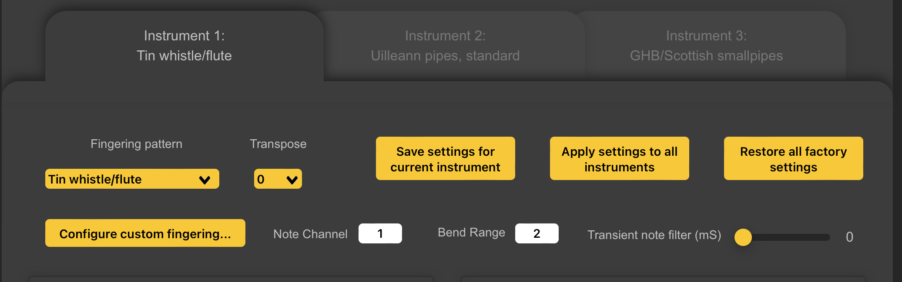
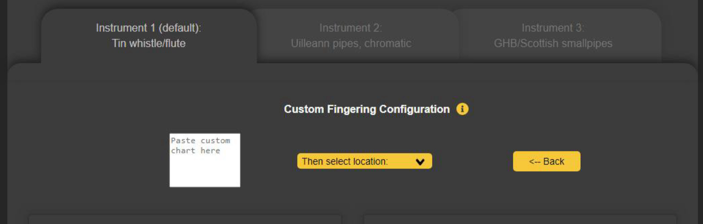

# Instrument Settings

WARBL has three *Instruments* available for use at any time, accessible by three *Instrument Tabs*. Each *Instrument* consists of a *Fingering Pattern* and a set of associated *Settings*. You can select different *Fingering Patterns* for each *Instrument*, or you can select the same *Fingering Pattern* for more than one *Instrument*.

For example, if you only want to use *Tin Whistle Fingering*, you can select that option for all three *Instruments*, but still have three different sets of *Settings* available at any time. You may want to have the *Settings* configured differently for each *Instrument*, or have different *Register Control* and/or *Slide/Vibrato* settings.

## Per-Instrument Settings
Selecting the *Tab* for an *Instrument* allows you to change the *Settings* for that *Instrument*. Please note that WARBL **responds immediately to changes to settings for each Instrument**, but if you don't save them, those changes will be lost when you power down WARBL.

* You can choose to apply changes to settings to the current *Instrument* (by clicking **Save settings for current instrument**), or
* You can choose to apply them to all three instruments (click **Apply to all instruments**).

	This can be useful if you want to make three *Instruments* that are the same except for minor differences (which can be changed after applying the *Initial Settings* to all three *Instruments*). 

* You can also *Restore all factory settings*.

## Default Instrument
You can set the *Default Instrument* that will be active when WARBL is plugged in. This prevents having to click a button to switch instruments if your current favourite *Instrument* is not *Instrument 1*.

To set the *Default Instrument*, simply click the *Tab* for that *Instrument* and then click *Set as Default*. This change will be saved immediately. This button does not appear in the *Default Instrument Tab*

## Fingering Pattern
The *Fingering Pattern Dropdown Menu* allows you to choose a *Fingering Chart*. Information about each chart is available on the [*Documentation* web page](https://warbl.xyz/documentation.html). Note that there are four *Custom Charts* available at the bottom of the list (see [Configure Custom Fingering][] below).

## Transpose Menu
This allows you to change keys. With WARBL2, if this is set to 0 (default), the *Selected Fingering Chart* will produce the notes shown in the [*Documentation*](https://warbl.xyz/WARBL%20Fingering%20Charts.pdf) (PDF).

You can *Transpose* up or down as much as *18 Semitones* to play in different *Keys*. Most *MIDI Apps* also allow transposing the received *MIDI Notes*, and often it is simpler to do this in the *MIDI App* rather than in the *Configuration Tool*. 

	NOTE: With the original WARBL, this Menu will default to an Offset Value, but will still play by default in the Key shown in the documentation.

## Configure Custom Fingering

Tapping this *WARBL2 Button* opens the *Custom Fingering Configuration Panel*, where you can create *Custom Fingerings*. Tapping the *<-- Back Button* will close this Panel.

WARBL2 has the ability to store up to 4 completely customizable *Fingering Charts*. Each Chart contains 256 *MIDI Notes* for every possible combination of the 8 tone holes (the *Bell Sensor* is not used).

You will be pasting a list of 256 MIDI notes and their *Fingerings* into the box on the left.

A special *Google Sheet* is available that will help you create your *Custom Fingering Chart*. [A Link for the Sheet](https://docs.google.com/spreadsheets/d/1TiOm5iydLx7kXBsjmasravbg9PUEOyIMRFGYa4KknoA/edit?usp=sharing) can be found on the [WARBL Documentation Page](https://warbl.xyz/documentation.html).

You don't have to use this sheet but it helps simplify the process of making a *Custom Fingering Chart*. You'll need to save your own copy of the *Google Sheet* so you can edit it.

More information about how to make a *Custom Fingering Chart*use can be found in the [WARBL User Manual](https://warbl.xyz/WARBL2%20User%20Manual.pdf) (PDF) and in the [WARBL2 Custom Fingering Charts](https://www.youtube.com/watch?v=1wNI8WVKetg) *Video* on the [Facebook WARBL Group](https://www.youtube.com/@warbl335).

Once you have made your *List of MIDI Note Numbers*, paste the values into the box at the left. Next, select one of *Four Custom Charts* in the center *Then select location:* dropdown menu as the location for saving the *Custom Fingering Chart*. (If you have previously saved a Chart in this same location it will be overwritten).

It will take several seconds to load the new chart onto the *WARBL2*. After you have done this, click the *<-- Back* button,  then select your *Custom Chart* from the *Fingering Pattern* dropdown menu (and **Save Changes** if desired).

##  Note Channel 
Allows you to select the *MIDI Channel* (1-16) used for *Sending Notes From WARBL*. This should typically be left set to **1**.

## Bend Range
Is the number of *Semitones of Pitch Bend* that the WARBL will allow. This should typically be set to the default value of **2**.

## Transient Note Filter (mS)
Filters out very brief *Unwanted Notes* by adding a small delay in Milliseconds to the *Tone Hole Sensors*. This can be particularly useful when using *Note Annotation Software* to transcribe your playing. Without this delay, *Very Brief Notes* that you might not necessarily hear will be transcribed.

This can also be used to clean up the sound of your playing by removing *Crossing Noises* that occur while changing from one *Fingering Pattern* to another. Be aware, however, that because this *Filter* works by adding a delay; setting it too high will give a sluggish feel to your playing. Set it to **0** for the fastest possible *Tone Hole Response*.

[Repeat Section](#instrument-settings) -- [Table of Contents](#table-of-contents)

