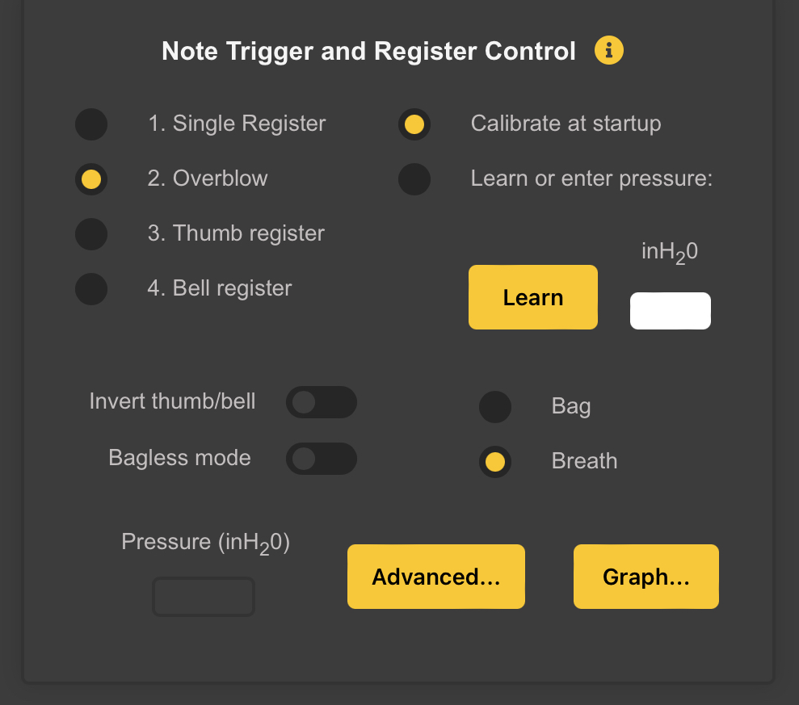
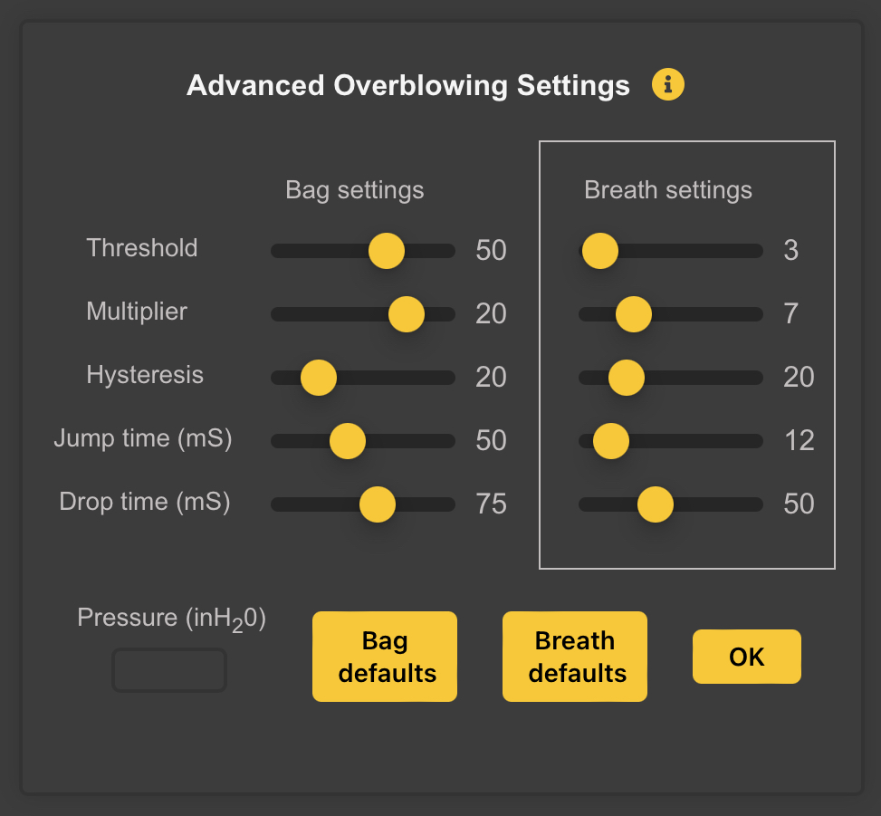
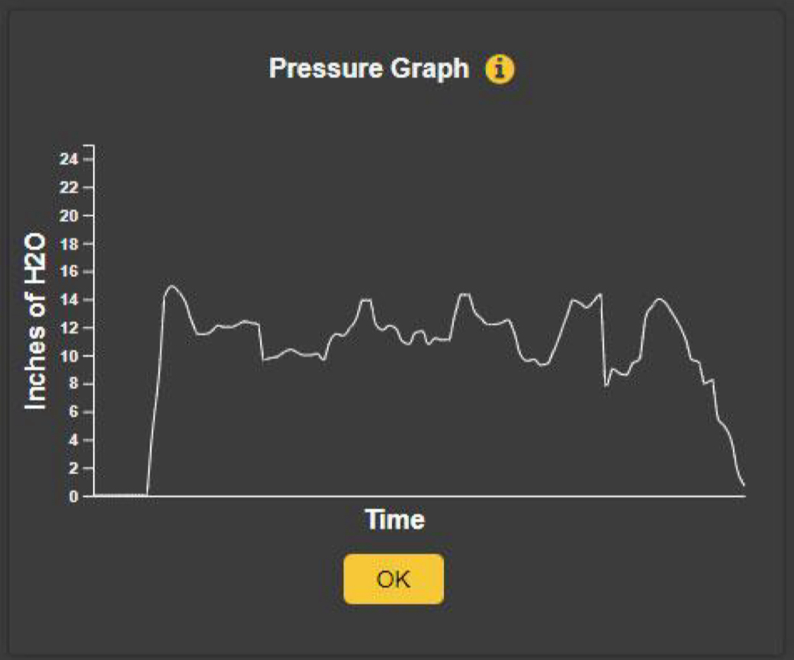

# Note Trigger and Register Control

You can play in a *Single Register* or choose from *Several Options for Controlling the Register*. 

## Single Register
Will allow you to use breath or bag pressure to start/stop notes, but will only allow access to one register. The pressure sensor can be used to mimic the way that whistles, flutes, and some bagpipes can be "overblown" to reach the second octave.

## Overblow
Enables Overblow

## Thumb Register
Allows you use that finger to control the *Register*, which will be familiar to players of many *Woodwind Instruments*. To play the *Upper Register*, simply uncover the thumb hole.

## Bell Register
Uncovering the *Bell Sensor* (lifting it off your knee), will access the **Second Register**.

## Calibrate at startup
The *Pressure Sensor* normally will be calibrated at *Startup*, meaning that the pressure when you plug in the device will be used as a *Base Point* for determining the *Pressure Level* at which sound will be triggered. This is desirable if you are using breath to control the instrument.

If you are using a *Bag* with this setting, you will want to squeeze it when you plug WARBL in to set the *Pressure* at which you want *Notes to Begin Playing*.

## Learn or Enter Pressure
Alternatively, you can select to use a different *Startup Pressure*. This is usually preferable if you are using a *Bag* instead of *Breath*, and you want to trigger notes at a higher pressure.

Squeeze the bag at the pressure that you would like to use for initial triggering of sound and then click *Learn*, which will cause WARBL to use the current pressure (as with all settings, you can save this pressure by saving the settings for the current instrument).

After clicking *Learn*, the *Pressure Input Cell* will flash **Green** and the *Learned Pressure* will be displayed. You can also enter the desired pressure manually if you prefer. Simply type in a pressure between 0.0 and 24.0 inH~2~O (Inches of Water) and hit **Return** or **Enter**. The *Input Cell* will momentarily turn **Green** to indicate that the pressure setting was sent to WARBL.

## Invert Thumb/Bell Switch
Reverse the functionality for either of the previous two options. Covering the *Left Thumb Hole* or covering the *Bell Sensor* then will allow playing in the **Second Register**, depending on which option is selected. This will be more familiar to players of instruments with a *Register Key*.

	Note: You can also use the IMU Elevation Angl to control the Register. This is discussed in the Pressure and IMU Mapping section.
	
## Bagless Mode
Turning on *Bagless Mode* will allow you to configure a *WARBL2 Button* to start/stop the *Sound* instead of using the *Pressure Sensor*. This will be similar to many electronic bagpipe chanters that don't use pressure sensing. You can still select one of the options for controlling the register when using *Bagless Mode*.

	Note: if you choose the Bagless option you must also configure a Button to Play/Stop (Bagless Mode).

## Bag/Breath
* Selecting *Bag* will cause the *Overblowing Settings* for *Bagpipe Bags* to be used
* Selecting *Breath* will cause the settings for *Breath (Mouthpiece)* to be used.

These settings are customizable using the *Advanced Panel* if desired. If you have an original WARBL with firmware version 2.0 or earlier, you will see a *Vented* switch instead of the bag/breath options.

## Advanced Register Control Settings

These settings control the way that the **Register** is changed by *Overblowing*. Each variable below has a setting for a *Bag* and one for *Breath (Mouthpiece)*. Which settings are used depends on whether you currently have *Bag* or *Breath* selected in the main *Note Trigger and Register Control Panel*.

	Note The Currently Selected group of Settings are surrounded by a White Box.

The *Variables* that are most likely to need adjustment are located near the top. 

### Threshold
Represents how much pressure is required to move from the **First Register** to the **Second Register**. Increasing this setting gives you more control over the Registers but also makes it require more *Breath* or *Bag* pressure to overblow.

### Multiplier
*Wind Instruments* that respond to *Overblowing* typically require more pressure to move to the **Second Register** from *Higher Notes* in the scale than it does from *Lower Notes* in the scale. This setting controls how pronounced is this difference. Increasing this setting can give you better control over the Register, especially if using a Bag, but will also increase the pressure required to reach the **Second Register**,  particularly from higher notes in the scale.

	Note: Setting both Threshold and Multiplier too high can make it impossible to reach the highest notes in the Second Register because the pressure sensor is saturated, i.e. it has reached the highest pressure it can detect. If you find that you cannot reach the highest notes in the second register, try  slightly reducing one or both of these settings.

### Hysteresis
Makes it slightly easier to stay in the **Second Register** than it is to initially reach that Register. In other words, the pressure threshold for moving up to the **Second Register** is slightly higher than the threshold for moving back down. This is how real *Wind Instruments* behave.

### Jump and Drop Times
WARBL has the ability to *Jump* directly from silence to the **Second Register** or to *Drop* directly from the **Second Register** to **Silence**.
* By *Blowing Forcefully* (particularly by *Tonguing* a *Note*), you can begin playing in the **Second Register** without first playing a brief *Note* in the **First Register**.
* By *Cutting Off Air Pressure Suddenly*, you can drop directly from the *Second Register* to *Silence*.

WARBL detects the player's intent by waiting a small amount of time for a *Register Threshold* to be crossed, or for the *Pressure* to level off, to. 
* Increasing the *Jump time* setting makes it easier to move directly to the **Second Register**.
* Increasing the *Drop time* has a similar effect for moving directly from the **Second Register** to **Silence**.

### Bag and Breath Defaults Buttons
* Clicking the *Bag Defaults Button* restores the *Default Bag Settings* for all *Variables* in the *Panel*
* Clicking the *Breath Defaults Button* restores the *Default Settings for Breath*.

Units are not shown for some *Settings* because they use arbitrary units.

## Pressure Graph

Shows WARBL pressure sensor readings in inches of H~2~O over time.

