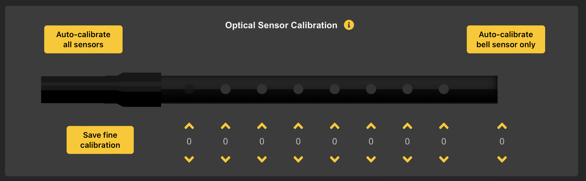

# Optical Sensor Calibration

The *Optical Sensors* may occasionally need to be *Calibrated*, for example
* When the WARBL2 is new
* If a new person is playing the device, or
* The sensors are a bit dirty.

*Calibration* can also be used in a pinch to compensate for having dirty hands, but it's much easier to wash your hands...

## Auto-Calibrate All Sensors
If the *Calibration* is *Far Off* or you want to *Calibrate Quickly*, you can run *Auto-Calibration*.

1. Begin by holding the WARBL2 in a *Well-Lit Room* (but not *Direct Sunlight*) in such a way that no *Tone Holes* are covered. (Important because it gives the WARBL2 examples of *Raw Sensor Readings*)
2. Then click *Begin Auto-Calibration*. The LED on WARBL will turn on and then you'll have *10 Seconds* to lightly place your fingers over *All the Tone Holes*.
		Pressing harder on each *Tone Hole* will make it more difficult to "cover" them after *Auto-Calibration*.

After this the *Calibration* should be reasonably close.

The *Bell Sensor* will only be *Calibrated* if it is currently *Plugged In*. If this is the case, *Rest the Bell Sensor* on whatever *Surface* you intend to use with it, while also covering the *Tone Holes* with your fingers. 

	Note that auto-calibration is always saved immediately; it is not necessary to click Save fine calibration afterward.

## Auto-Calibrate Bell Sensor Only
You also have the option of auto-calibrating only the bell sensor. This is useful because the sensor may respond differently depending on the type of clothing you're wearing. To do this, hold WARBL up in the air so the sensor is completely uncovered, click Auto-calibrate bell sensor only, and then lower the sensor onto your knee. After five seconds, the LED with turn off and the sensor will be calibrated.

## Save Fine Calibration
After *Auto-Calibration* or for more frequent adjustments, you can just *Fine-Tune Each Sensor Individually*.

* Clicking the *Up Arrow* will make it easier to "cover" the *Tone Hole*
* Clicking the *Down Arrow* will make it more difficult.

		Note that when you plug in WARBL, values for each sensor will always read zero, and any changes will be relative to the current calibration.

*Changes to individual sensors* will take place *immediately* so you can test them as you are changing them.

	You must click Save fine calibration for the changes to be saved, otherwise the Calibration will be reset when the WARBL2 is unplugged.

