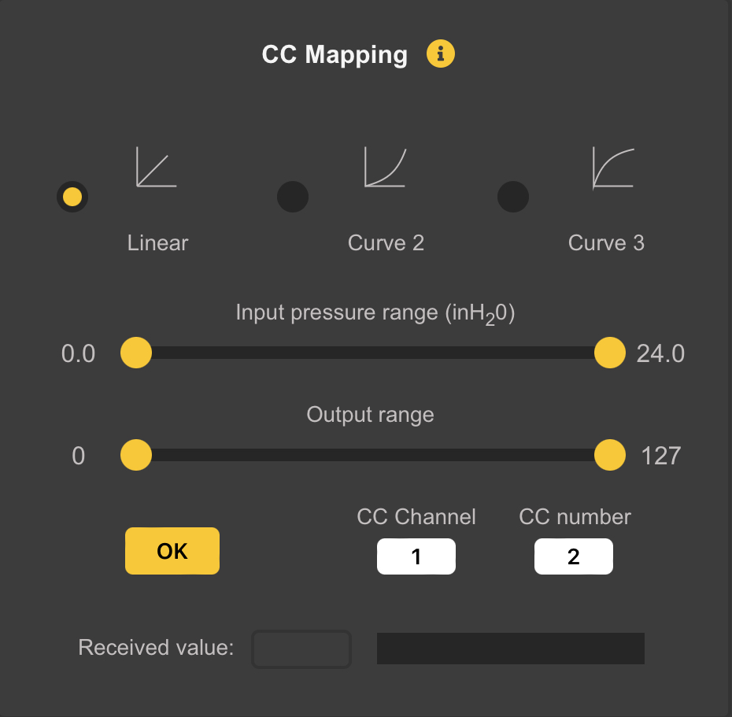
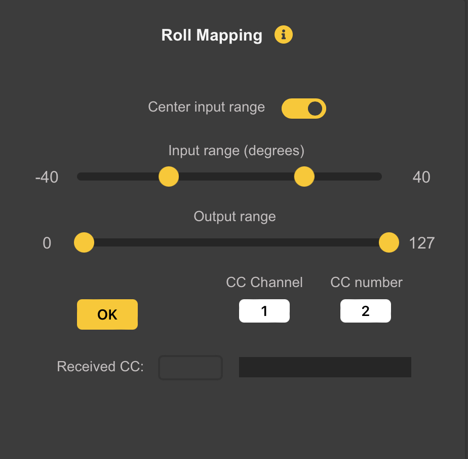

# Pressure and IMU Mapping

*Breath Pressure* and *IMU (Gyroscope and Accelerometer)* data can be mapped to various *MIDI Messages*. Click on *Pressure Mapping…* or *IMU Mapping…* to see the options.

## Pressure Mapping

This was known as the *Expression Panel* in earlier versions of the *Configuration Tool*. It allows mapping of *Breath* (or *Bagpipe Bag*) *Pressure* to various *MIDI Messages*.

### Force Max Velocity 
Turning on the *Force Max Velocity* switch will cause WARBL to always send *MIDI Notes* with a *Velocity* of **127** (the maximum allowed), which will allow *Maximum Volume* from *MIDI Apps*.

	Note: Some more sophisticated Apps interpret High Velocity in ways that also affect their Timbre, or various other Effects. 
	
	If this is the case, you may want to uncheck this Switch, which will cause WARBL to send notes with a Velocity of 64 (the middle of the allowed range). This switch has no effect if the Send Pressure as Velocity is selected.
	
	Selecting the Send Pressure as Velocity Switch automatically overrides and turns OFF the Force Max Velocity switch at the top of this panel.

### Pitch Expression
Turning on the *Pitch Expression* switch will cause WARBL to send *Pitch Bend Messages* based on *Pressure*. This means that for a given *MIDI Note*, blowing (or squeezing a *Bag*) **gently** will cause the *Note* to play slightly **Flat**, while blowing with **excess force** will cause it to be slightly **Sharp**. This is meant to simulate the way that *Pressure* is used to *Fine-Tune the Pitch of Real Instruments*, and can make WARBL sound more lifelike. 

### Pitch Expression Depth 
The *Pitch Expression Depth* slider controls the amount of *Pitch Bend*, which is added to any contributed by *Vibrato* and *Slide*, so they can all be used simultaneously. 

### Override...
If *Overblowing* is not being used, this gives you have the option of changing the *Default Pressure Range* used for *Expression*.

By turning on the *Override Switch* and using the Sliders, you can override the *Default Pressure Range* used for *Pitch Expression*.

	Note: This is not available if Overblowing is being used, because in that case the Pressure Range has to be calculated in Real Time based on the current Register and Overblowing settings.

### Send Pressure Mapping

WARBL also has the ability to *Map Pressure Sensor Values* to
* A MIDI Continuous Controller (CC)
* Note-On Velocity
* Channel Pressure, and
* Key Pressure

This allows it to function as a *MIDI Breath Controller*. An example would be to send *Pressure* data to **CC7** to control the *Notes Volumes* with *Pressure*.These *Advanced Settings* are not needed by many WARBL users.

The *Input Pressure Range* can be mapped to the *Output Range* (*CC, Velocity, Channel Pressure,* or *Key Pressure*) using one of three curves:

* Linear
* A Power Curve (Curve 2), or 
* An Inverse Power Curve (Curve 3)

Adjusting the *Sliders* controls which portion of the overall *Breath/Bag Pressure* is mapped to which portion of the possible *MIDI Output Range* of 0-127. When *Mapping Pressure to CC* you can choose a *CC Channel* and *CC Number*.

	NOTE: WARBLE2 will only be sending those Messages if the corresponding Switch in the main Pressure Mapping Panel is turned ON.

The *Received Value* field and bar at the bottom show the *MIDI Messages* received from the WARBLE2 that correspond to the *Current Panel*. For example, if you are mapping *Breath Pressure* to **CC 7** on *Channel 1*, the display will show only those specific messages.

## IMU Mapping

The *Inertial Measurement Unit (IMU)* continuously tracks *Acceleration* and *Angular Rotation* in **Three Dimensions**. This information is converted to *Roll, Elevation Angle (Pitch),* and *Yaw*, which can be then mapped to *MIDI Messages*.

### Pitchbend Vibrato
There is also an option to send *Pitchbend Vibrato* by shaking the WARBLE2 along its *Long Axis*. You can adjust the amount of *Shake Vibrato* and also select the *Direction of Pitchbend*:

* *Up/Down* means that the *Pitch* will be altered *both above and below the normal pitch*, corresponding to the *direction of movement of the WARBL2*.
* *Down/Up* has the same effect but *the opposite direction of the movement of the device*.
* *Up only* causes *Pitch* to be only *raised above the current note*, and 
* *Down* only causes the pitch to only be *flattened*

### Roll, Elevation, and Yaw Mapping

To map *Roll, Elevation,* or *Yaw* to *CC Messages*, turn **ON** the appropriate *Switch* and then click *Map*. A *Panel similar to the one above* will appear, allowing you to select the *Input Range* as well as the *Range* of *Output CC Values*. 

At the bottom a *Readout* and *Bar* will display *CC Messages Received* from the *WARBL2* that match the *Current Settings in the Panel*

	Note: The Switch on the Previous Panel must also be turned ON to cause the WARBL2 to actually send any Messages.
	
For mapping *Roll* and *Yaw*, there is an option to *center the Input Range*, which *Ties the Input Sliders Together* to keep the *Input Range* centered on **Zero**.

	Note: It is impossible to Reverse the Output Range of the IMU Mapping in the WARBLE2 by moving the Output Sliders past each other. When they meet in the Middle of the Range they will Merge into one. Moving this to the Right or Left will show the two Yellow Range Limits.

### Recentering Yaw
*Yaw* has a tendency to drift slightly over time, so you may want occasionally to *Recenter* it (i.e. set it to **zero**). It is also often desirable to *Recenter the Yaw* depending on the *Rotation of your Body*. 

There are three ways to recenter Yaw:
* A button in the *WARBLE2 Settings Panel* will recenter it *center*
* You can assign a button action to recenter it (see the Button Behavior panel documentation), or
* You can use the auto-center yaw option in the yaw mapping panel.

The auto-center yaw option will reset the yaw to zero when you begin playing after a pause of a certain length of time. You can choose the length of the pause with the Minimum pause slider.

There is also an option to control the register using the IMU elevation angle. You can choose the total number of registers and the input elevation range. The normal playing range (based on the “transpose” setting) will be in the middle of the range and you will be able to play up to two registers above and below that range. If overblowing is also enabled you will be able to use both methods of register control simultaneously.

