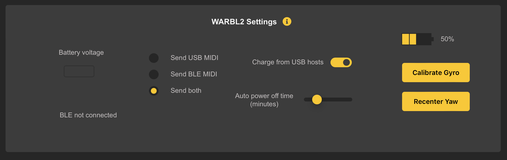

# WARBL2 Settings

Contains information and settings specific to WARBL2. Changes are saved immediately; it is NOT necessary to *Save Settings for the Current Instrument*, and as with *Sensor Calibration*, they apply to the *Entire Device* rather than a *Specific Instrument*.

## Battery Voltage
Is shown as a convenience, but the *Battery Percentage Monitor* on the far right is usually a more reliable indicator of *Charge Level*.

	Note: Battery Charge Level is an Estimate and becomes more accurate after letting the Battery run all the way down (until the WARBL2 powers OFF), then re-charging fully.

When *Charging*, a *Charging Icon* is shown next to the *Battery Percentage Monitor*. If the *Charging Icon* is **blinking**, it may be:
* An *Indicator of a Battery Fault* such as:
	* *Very Low* or *Very High Temperatures*, or
* The *Battery* is *Too Old to Charge*

## BLE status
Shown at the *Bottom Left*. When connected by BLE it will show the *Connection Interval* in *Milliseconds*.

## Send BLE/USB
If the WARBL2 is connected to both *BLE* and *USB*, you can choose whether to send *MIDI Data* over *Either* or *Both* connections. If only *One Connection* is available, it will be used regardless of this setting.

WARBL2 will also communicate with the *Configuration Tool* by *All Available Connections* regardless of this setting.

## Charge From USB Hosts
WARBL2 can be charged from any *USB Host*
* PC, Mac, Tablet, or ‘phone, or
* From a *USB Charging Brick*.

Charging from a *USB Host* can be turned *Off*, recommended if you are using *USB MIDI* and the WARBL2 is often connected to a *Host*. This will help save the battery of your *Host Device*.

## Auto Power Off Time
To save battery life, WARBL2 will *Shut Down Automatically* after some time if no *MIDI Notes* have been sent or commands have been received from the *Configuration Tool*.

You can adjust the *Power Off Time* from **1** to **20** minutes. You can also *Assign a Button Action to Power Off* in the *Button Behavior Panel*.

## Calibrate Gyro
The *Gyroscope* is calibrated when the WARBL2 is made, but you may wish to *Calibrate It Again* occasionally (especially if the *Roll* and *Elevation* seem to drift slightly when the WARBL2 is stationary).

Set the WARBL2 on a *Stationary Surface* and click *Calibrate Gyro*.

## Recenter The Yaw
If you are using *IMU Yaw* to send *MIDI Data*, you can *Recenter the Yaw* with this *Button*. You also can:
* Assign a *Button Action* to *Recenter the Yaw*
	* In the *Button Behavior Panel*, and
* *Automatically Recenter the Yaw* when there is a break in *Notes*
	* In the *Yaw Mapping Panel* 

